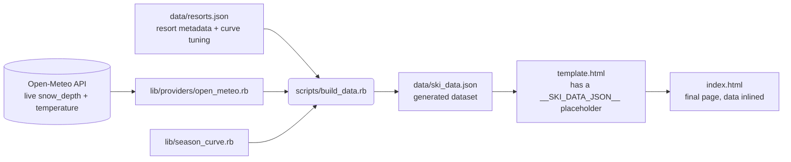

# Architecture

## Overview

Foray Ski Adventure is a static, backend-free web page, deployed via GitHub
Pages. There's no server: a Ruby build script computes everything it can
ahead of time and inlines it into `index.html` as JSON, so the page renders
instantly from that snapshot on load — and then the browser makes one direct
request to Open-Meteo to refresh live conditions in place. Historically (see
below) even that client-side request wasn't possible.

This shape is a holdover from the project's original deployment target, a
Claude Artifact, which sandboxes the page: no outbound network requests, no
external map tiles. GitHub Pages has no such restriction, which is what made
both the live client-side fetch and the switch to a real Leaflet +
OpenStreetMap map possible — the Claude Artifact deployment still runs an
earlier, sandbox-compatible version with a hand-projected static SVG map and
no live fetch, since it has no other option.

## Build-time pipeline

`scripts/build_data.rb` is a thin orchestrator — the actual work is in two
`lib/` modules it calls in order:

1. **Fetch live conditions.** `Providers::OpenMeteo#fetch` makes one batched
   HTTPS request to Open-Meteo for all resorts' current `snow_depth` and
   `temperature_2m`. It's the one part of the pipeline that touches the
   network, isolated so a future test can stub it instead of hitting the
   real API.
2. **Generate the illustrative season curve.** `SeasonCurve.generate` is pure
   computation, no I/O: for each resort, a bell curve (peaking at its own
   `typical_peak_cm` on a shared mid-February date) and a parabolic
   temperature curve (mild at the season edges, coldest at that same date),
   sampled every 3 days from Dec 1 to Apr 30. This is synthetic — clearly
   labeled as such in the UI — because no real historical time series
   exists yet.
3. **Write outputs.** `data/ski_data.json` (the raw generated dataset, useful
   on its own) and `index.html` (the template with that JSON spliced into the
   `<script type="application/json">` placeholder).

There's no map-projection step here anymore — resorts carry their raw
`lat`/`lon` straight through, and Leaflet does the projection in the browser.

## Client-side render pipeline

Everything after that lives in `assets/app.js` (referenced from `index.html`
via `<script src>`) and `assets/styles.css` — only the generated JSON stays
inlined in the page, since that's the one thing that has to travel with it.
`app.js` is a single IIFE with no build step; the only external dependency is
[Leaflet](https://leafletjs.com/) (loaded from cdnjs), which owns the map
itself, while everything else — state, rendering, the chart — is plain
DOM/SVG with no framework. There's one mutable `state` object
(`{ mode, dayIndex, selectedId }`) and a `refreshAll()` function that
re-derives all on-screen output from `state` + the embedded `DATA`:

| Function | Responsibility |
|---|---|
| `getDisplay(resort)` | Picks live vs. typical-season values for one resort based on `state.mode`/`state.dayIndex` |
| `tempToColor(temp)` | Diverging color scale, temperature → hex/rgb |
| `depthToRadius(depth)` | Area-proportional size scale, snow depth → marker radius |
| `renderMarkers()` | Updates every Leaflet `circleMarker`'s radius/fill/stroke via `setStyle()` |
| `renderList()` | Rewrites each resort row's text in the sidebar list |
| `renderSizeLegend()` | Draws the size-legend circles using the same `depthToRadius` scale |
| `renderChart(resort)` / `renderFigures(resort)` | Draws the selected resort's season chart and monthly-figures table |
| `renderDetail(resort)` | Updates the stat row and calls the chart/figures renderers |
| `select(id)` / `setMode(mode)` / slider handler | Mutate `state`, then call `refreshAll()` (or `renderDetail` directly for `select`) |

There is no framework, no virtual DOM, and no build step on the client side —
`refreshAll()` just re-renders everything on every state change, which is fine
at this scale (20 resorts, a handful of DOM nodes each).

## Key design decisions

- **Area, not radius, for marker size.** Radius scaling linearly with depth
  makes a 6x difference in snow depth look like a ~33x difference in visual
  area (Stevens' power law). `depthToRadius` scales so *area* is proportional
  to depth (`radius ∝ √depth`), which is the standard, honest convention for
  proportional-symbol maps.
- **Diverging temperature color, centered on 0°C, with squared easing.** Blue
  below freezing, neutral gray at freezing, warm above — because freezing is
  the threshold that actually matters for snow. Linear interpolation between
  the cold and neutral colors looked muddy for realistic winter temperatures
  (mostly -6°C to -16°C), so the interpolation fraction is squared, which
  keeps hues saturated away from the pole and reserves gray for values
  genuinely close to 0°C.
- **0cm renders as a hollow ring at 60% of the floor size**, not a filled dot.
  A filled dot at the minimum radius is visually close to "a small amount of
  snow," which is ambiguous. A smaller, hollow ring is unambiguously "bare
  ground."
- **Leaflet + OpenStreetMap tiles, not a static SVG.** The previous hand-baked
  SVG coastline had a real functional gap: with 20 resorts, several sit close
  enough together (the Nagano/Niigata cluster especially) to overlap into an
  unclickable clump, and a static image has no way to zoom in and separate
  them. Leaflet fixes that directly. GitHub Pages removing the tile-loading
  restriction is what made this possible at all.
- **One tile source, not two.** Dark mode is a CSS `filter: invert(...)` on
  the tile layer, not a second "dark" tile provider. A free CartoDB dark-tile
  endpoint was tried first and started demanding an API key mid-development
  with no code-visible warning — exactly the kind of third-party dependency
  risk worth avoiding when a CSS filter on the one tile source Leaflet
  guarantees (plain OpenStreetMap, no key, ever) gets a perfectly usable dark
  map for free.
- **Scroll-wheel zoom is off.** A map embedded in a page that captures the
  mouse wheel fights the page's own scrolling the moment the cursor happens
  to be over it — a real papercut hit during testing, not a hypothetical one.
  The zoom buttons, double-click-to-zoom, and touch pinch-zoom (all Leaflet
  defaults) don't have this problem, so wheel capture is disabled and the
  page always scrolls normally over the map.
- **Markers are keyboard-operable, which Leaflet doesn't provide by
  default.** Leaflet's SVG renderer gives each `circleMarker` a real DOM
  element (via `.getElement()`), so `tabindex`, `role="button"`, and a
  `keydown` handler are attached by hand to preserve the keyboard access the
  previous plain-SVG markers had. This is easy to lose silently when
  swapping to a mapping library — worth calling out for anyone touching this
  code later.
- **The build-time snapshot is embedded inline, and the page opens with it
  immediately** — there is no loading state for the initial render. On GitHub
  Pages, a `fetchLiveConditions()` call then goes out to Open-Meteo directly
  from the browser (the same batched request `build_data.rb` makes) and
  overwrites each resort's live depth/temperature in place once it resolves;
  if it fails for any reason, the page just keeps showing the snapshot and
  the header label switches to "snapshot (live refresh failed)". This was not
  possible under the Claude Artifact sandbox, which blocks `fetch`/XHR to
  external hosts — that version still relies entirely on the baked-in
  snapshot.
- **CSS and JS live in their own files, not inlined in the page.** The
  extraction is purely mechanical — `assets/app.js`'s internals are unchanged
  from when they lived in `template.html`'s inline `<script>` — but it's what
  makes the pure functions in it (`tempToColor`, `depthToRadius`, etc.)
  reachable for a future test runner at all. The `state`-mutation pattern and
  the string-concatenated `innerHTML` in `renderList`/`buildDetailSkeleton`
  are still exactly as fragile as before the extraction; only the file
  boundary changed (see PROPOSALS.md §1 for what's still open there).
- **The season curve is synthetic, not measured.** It exists to make the
  visualization meaningful during the off-season (when live depth is 0cm
  almost everywhere) and to preview what the size/color encoding looks like
  across a full range of values. It is explicitly labeled as illustrative
  everywhere it appears.

## Known constraints (as of this snapshot)

- Live conditions refresh client-side on GitHub Pages, but the "typical
  season" curve is still fixed at whatever `scripts/build_data.rb` last
  produced — regenerating it still requires re-running the script and
  redeploying.
- The Claude Artifact version is now meaningfully behind: no live fetch, and
  the old static-SVG map instead of Leaflet, since its sandbox permits
  neither.
- The map now depends on two external services at runtime — Leaflet (from a
  CDN) and the public OpenStreetMap tile server — where the previous version
  depended on none. OpenStreetMap's tile server has a fair-use policy; fine
  at this project's traffic, worth knowing about if that changes.
- No real historical data — the "typical season" curve is a hand-tuned bell
  curve, not recorded observations.
- `rake test` covers the Ruby side (`lib/season_curve.rb` and
  `lib/providers/open_meteo.rb`, the latter with the network call stubbed),
  and `.github/workflows/test.yml` runs it on every push and pull request to
  `main`. Nothing covers `assets/app.js` yet — its functions aren't exported,
  and `tempToColor` still reads CSS custom properties via `document`, which
  plain Node can't do (see PROPOSALS.md §3b for what's actually blocking it).
