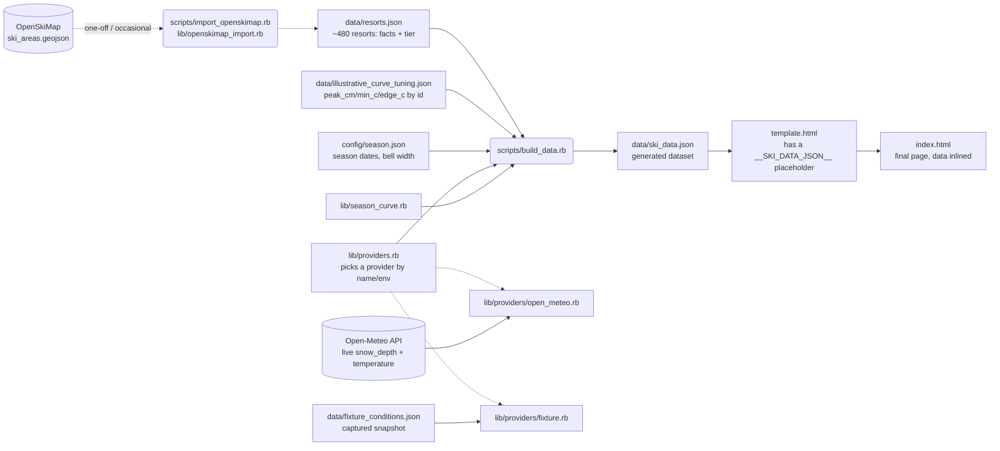

# Architecture

## Overview

Foray Ski Adventure is a static, backend-free web page, deployed via GitHub
Pages. There's no server: a Ruby build script computes everything it can
ahead of time and inlines it into `index.html` as JSON, so the page renders
instantly from that snapshot on load — and then the browser makes direct
requests to Open-Meteo, in batches and only for the resorts currently on
screen, to refresh live conditions in place. Historically (see below) even
that client-side request wasn't possible.

This shape is a holdover from the project's original deployment target, a
Claude Artifact, which sandboxes the page: no outbound network requests, no
external map tiles. GitHub Pages has no such restriction, which is what made
both the live client-side fetch and the switch to a real Leaflet +
OpenStreetMap map possible — the Claude Artifact deployment still runs an
earlier, sandbox-compatible version with a hand-projected static SVG map and
no live fetch, since it has no other option.

## Build-time pipeline

The dotted path at the top is separate from the normal build:
`scripts/import_openskimap.rb` occasionally folds operating downhill areas
from OpenSkiMap into `data/resorts.json` (see "Resort import" under Key
design decisions). `resorts.json` is committed, and `build_data.rb` just
reads it.

`scripts/build_data.rb` is a thin orchestrator:

1. **Merge resort facts with curve-tuning knobs.** `data/resorts.json` holds
   *facts* (name, region, prefecture, coordinates, elevation, size tier, run
   length); `typical_peak_cm`/`typical_min_c`/`typical_edge_c` live
   separately in `data/illustrative_curve_tuning.json`, keyed by resort id,
   and get merged in by id. **An entry is optional: a resort without one has
   no typical-season curve and is live-only** — that's the case for all but
   the ~27 larger resorts. Once a resort has real historical data, its
   tuning entry just goes away — `resorts.json` itself never needs to change
   shape for that. A tuning key that matches no resort raises, since a typo
   there would otherwise silently drop a curve.
2. **Fetch live conditions**, from whichever provider `lib/providers.rb`
   resolves (`SNOWPACK_PROVIDER` env var, default `open_meteo`).
   `Providers::OpenMeteo#fetch` requests Open-Meteo for all resorts' current
   `snow_depth` and `temperature_2m`, 100 locations per request (coordinates
   travel in the query string, so ~480 in one GET would exceed common URL
   limits) — it's the one part of the pipeline that touches the network,
   isolated so a test can stub it instead of hitting the real API.
   `Providers::Fixture#fetch` instead reads a captured snapshot
   (`data/fixture_conditions.json`) with no network access at all — real
   value on its own (offline development, a flaky connection, fast
   deterministic builds), not just a proof that the interface works.
3. **Generate the illustrative season curve.** `SeasonCurve.generate` is pure
   computation, no I/O: for each resort, a bell curve (peaking at its own
   `typical_peak_cm` on a shared date) and a parabolic temperature curve
   (mild at the season edges, coldest at that same date). The season's
   dates and the bell curve's width come from `config/season.json` — passed
   in as parameters, not read from the file inside `season_curve.rb` itself,
   so the module stays pure and its default behavior (what the existing
   tests exercise) never depends on a config file being present. This is
   synthetic — clearly labeled as such in the UI — because no real
   historical time series exists yet.
4. **Write outputs.** `data/ski_data.json` (the raw generated dataset, useful
   on its own) and `index.html` (the template with that JSON spliced in, and
   `assets/app.js`/`assets/styles.css`'s `` inside one would otherwise end the data element early.

There's no map-projection step here anymore — resorts carry their raw
`lat`/`lon` straight through, and Leaflet does the projection in the browser.

## Client-side render pipeline

Everything after that lives in `assets/app.js` (referenced from `index.html`
via `<script src>`) and `assets/styles.css` — only the generated JSON stays
inlined in the page, since that's the one thing that has to travel with it.
`app.js` is a single IIFE with no build step; the only external dependency is
[Leaflet](https://leafletjs.com/) (loaded from cdnjs), which owns the map
itself, while everything else — state, rendering, the chart — is plain
DOM/SVG with no framework. There's one mutable `state` object
(`{ mode, dayIndex, selectedId, regions, tiers, query, mapOnly, ranking }`),
changed only through `setState(patch)`, and a `refreshAll()` function that
re-derives all on-screen output from `state` + the embedded `DATA` + the
map's current zoom and bounds:

| Function | Responsibility |
|---|---|
| `getDisplay(resort)` | Picks live vs. typical-season values for one resort based on `state.mode`/`state.dayIndex` |
| `tempToColor(temp, coldHex, midHex, warmHex)` | Diverging color scale, temperature → hex/rgb |
| `depthToRadius(depth)` | Area-proportional size scale, snow depth → marker radius |
| `classifyResort(resort, ctx)` | Pure. Decides `'active'` / `'dim'` / `'hidden'` from mode, zoom, filters, search, selection and the active Top-10 ranking (see "Showing ~480 resorts" below) |
| `rankResorts(resorts, ranking, n)` | Pure. Top-n ids by `altitude` or `snow`, ties broken deterministically |
| `computeRanking()` / `isRankingReady(...)` | Recomputes the active ranking's ids from the current filters each refresh; `snow` waits until every candidate resort has been live-refreshed (or given up on) before ranking, so it's never a mix of fresh and stale depths |
| `placeRankedRows()` | Moves the ranked rows into one flat, numbered list box, swapped back into their region groups when the ranking ends |
| `renderMarkers()` | Adds/removes each `circleMarker` from a layer group by its class, and styles the visible ones via `setStyle()` |
| `renderList()` | Shows/hides each resort's pre-built row with `hidden`, and updates the visible rows' child ``s via `.textContent` |
| `renderFilters()` / `renderStatus()` | Chip on/off state and counts; the "Showing N of M" line |
| `refreshMapView()` | The map-view-dependent part of a refresh (markers, list, filters, status, live refresh), run on every map `moveend` so panning doesn't also redraw the detail chart |
| `refreshLiveConditions(resorts)` | Batched, once-per-resort client-side Open-Meteo refresh of what's currently on screen |
| `renderSizeLegend()` | Draws the size-legend circles using the same `depthToRadius` scale |
| `renderChart(resort)` / `renderFigures(resort)` | Draws the selected resort's season chart and monthly-figures table |
| `renderDetail(resort)` | Updates the stat row and calls the chart/figures renderers |
| `updateSelectionHighlight()` | Toggles `.is-selected` on the marker and row matching `state.selectedId` |
| `refreshAll()` | `refreshMapView()` plus the legend, detail card and date label — the one function that makes the DOM match `state` |
| `setState(patch)` | `Object.assign(state, patch)`, then `refreshAll()` — the only way `state` changes |
| `select(id)` / `setMode(mode)` / slider handler | Each calls `setState(...)` with its own patch; `setMode` also updates the mode-toggle widget's own visual state first, since that's the control's own concern rather than a `state`-driven render |

There is no framework, no virtual DOM, and no build step on the client side —
`refreshAll()` just re-renders everything on every state change, which is fine
at this scale: ~480 resorts, but classification is a cheap pure function, at
most a few hundred markers are ever on the map, and rows are built once and
only shown or hidden.

## Key design decisions

- **Area, not radius, for marker size.** Radius scaling linearly with depth
  makes a 6x difference in snow depth look like a ~33x difference in visual
  area (Stevens' power law). `depthToRadius` scales so *area* is proportional
  to depth (`radius ∝ √depth`), which is the standard, honest convention for
  proportional-symbol maps.
- **Diverging temperature color, centered on 0°C, with squared easing.** Blue
  below freezing, neutral gray at freezing, warm above — because freezing is
  the threshold that actually matters for snow. Linear interpolation between
  the cold and neutral colors looked muddy for realistic winter temperatures
  (mostly -6°C to -16°C), so the interpolation fraction is squared, which
  keeps hues saturated away from the pole and reserves gray for values
  genuinely close to 0°C.
- **0cm renders as a hollow ring at 60% of the floor size**, not a filled dot.
  A filled dot at the minimum radius is visually close to "a small amount of
  snow," which is ambiguous. A smaller, hollow ring is unambiguously "bare
  ground."
- **Leaflet + OpenStreetMap tiles, not a static SVG.** The previous hand-baked
  SVG coastline had a real functional gap: with 20 resorts, several sit close
  enough together (the Nagano/Niigata cluster especially) to overlap into an
  unclickable clump, and a static image has no way to zoom in and separate
  them. Leaflet fixes that directly. GitHub Pages removing the tile-loading
  restriction is what made this possible at all.
- **One tile source, not two.** Dark mode is a CSS `filter: invert(...)` on
  the tile layer, not a second "dark" tile provider. A free CartoDB dark-tile
  endpoint was tried first and started demanding an API key mid-development
  with no code-visible warning — exactly the kind of third-party dependency
  risk worth avoiding when a CSS filter on the one tile source Leaflet
  guarantees (plain OpenStreetMap, no key, ever) gets a perfectly usable dark
  map for free.
- **Scroll-wheel zoom is off.** A map embedded in a page that captures the
  mouse wheel fights the page's own scrolling the moment the cursor happens
  to be over it — a real papercut hit during testing, not a hypothetical one.
  The zoom buttons, double-click-to-zoom, and touch pinch-zoom (all Leaflet
  defaults) don't have this problem, so wheel capture is disabled and the
  page always scrolls normally over the map.
- **Markers are keyboard-operable, which Leaflet doesn't provide by
  default.** Leaflet's SVG renderer gives each `circleMarker` a real DOM
  element (via `.getElement()`), so `tabindex`, `role="button"`, and a
  `keydown` handler are attached by hand to preserve the keyboard access the
  previous plain-SVG markers had. This is easy to lose silently when
  swapping to a mapping library — worth calling out for anyone touching this
  code later.
- **`#map-tooltip`'s z-index (1100) has to clear Leaflet's own panes and
  controls (up to 1000), not just look "high enough."** It's a
  `position:fixed` sibling of `#map` in the DOM, not a descendant, so DOM
  order alone doesn't guarantee it paints on top — `#map` (`.leaflet-container`)
  never gets its own stacking context (`position:relative` with no explicit
  `z-index` doesn't create one), so Leaflet's internal panes are compared
  directly against the tooltip's z-index in the same stacking context. At
  the old value (50) the map's tile/marker panes painted over the tooltip
  everywhere they overlapped it, fully hiding it over the middle of the map
  and only letting it peek out past the map's own edges — reported as
  [#1](https://github.com/cedjec-sketcher/foray-ski-adventure/issues/1) and
  initially misdiagnosed as a viewport-overflow problem (a real, separate
  issue that also needed fixing, just not the one in the screenshot).
  Confirmed by inspecting Leaflet's actual computed z-indices at runtime
  before picking 1100, not by guessing a bigger number.
- **`assets/app.js`/`assets/styles.css` are cache-busted with a content
  hash, not requested with plain URLs.** GitHub Pages serves them with
  `Cache-Control: max-age=600` — confirmed directly on the live site, not
  assumed — so a browser that loaded the page once won't see a real change
  for up to 10 minutes on a plain reload, hard-refresh included on some
  browsers' handling of query-less URLs. That 10-minute window is exactly
  what made the z-index fix above look like it hadn't deployed when it had:
  a stale cached copy in the browser doing the checking, not a bad
  deployment. Every build stamps each asset's own `<script src>`/`<link
  href>` with `?v=<hash of that file's content>`, so an actual content
  change is always a new URL to the browser and never waits out the cache;
  an unchanged file keeps the same URL and stays cached, which is still the
  right behavior for it.
- **The build-time snapshot is embedded inline, and the page opens with it
  immediately** — there is no loading state for the initial render. On GitHub
  Pages, a `fetchLiveConditions()` call then goes out to Open-Meteo directly
  from the browser (the same batched request `build_data.rb` makes) and
  overwrites each resort's live depth/temperature in place once it resolves;
  if it fails for any reason, the page just keeps showing the snapshot and
  the header label switches to "snapshot (live refresh failed)". This was not
  possible under the Claude Artifact sandbox, which blocks `fetch`/XHR to
  external hosts — that version still relies entirely on the baked-in
  snapshot.
- **CSS and JS live in their own files, not inlined in the page.** The
  extraction itself was purely mechanical — `assets/app.js`'s internals were
  unchanged from when they lived in `template.html`'s inline `<script>` at
  the time it happened. The `state`-mutation pattern and `renderList`'s
  string-concatenated `innerHTML` were fixed in a later pass (see the
  `setState`/`textContent` decisions below) — the file move itself didn't
  touch either.
- **All `state` changes go through `setState(patch)`.** `select`, `setMode`,
  and the slider handler each just describe what changed; `setState` merges
  it in and calls `refreshAll()` unconditionally, so there's no longer a
  call site that could mutate `state` and forget to re-render. Marker/row
  selection highlighting moved into `refreshAll()` itself (as
  `updateSelectionHighlight()`) rather than living only inside `select()`,
  so it's one function's job to make the DOM match `state`, not several.
- **List rows update via `.textContent`, not `innerHTML`.** Each row's four
  child ``s are built once; `renderList()` only ever writes their text
  afterward. No resort-sourced string reaches `innerHTML` on every render
  the way it used to — the same pattern the detail panel and the map markers
  already used. `buildDetailSkeleton()`'s own `innerHTML` was left as-is: it
  builds static markup once, with no resort data interpolated into it, so it
  never carried the risk this was about.
- **`assets/app.js` splits into a pure section and a DOM-guarded section, so
  it's `require()`-able from Node.** Everything that touches `document`,
  Leaflet, or `fetch` — the large majority of the file — is wrapped in
  `if (typeof document !== 'undefined') { ... }`; the pure functions
  (`hexToRgb`, `lerpColor`, `tempToColor`, `depthToRadius`, `fmtDate`,
  `fmtFetched`) sit outside that guard, with a
  `typeof module !== 'undefined'` check at the bottom exporting them for
  Node. In a browser, `module` doesn't exist so the export is skipped and
  the DOM guard passes through transparently; in Node, `document` doesn't
  exist so the entire bootstrap section — map setup, event listeners, the
  live fetch, all of it — never runs. `tempToColor` also changed shape: it
  takes the three temperature-scale colors as parameters now instead of
  reading them via `cssVar()` internally, since a color function that reads
  `document.documentElement`'s computed style can't be pure. Verified
  byte-identical output in the browser before and after this change
  (Asahidake at -16°C still renders as exactly `rgb(47,131,224)`).
  `getDisplay` stays inside the guard — it closes over `state`/`DATES`,
  which only exist there — so it's still not test-reachable; see
  PROPOSALS.md, "Testing gaps".
- **The season curve is synthetic, not measured.** It exists to make the
  visualization meaningful during the off-season (when live depth is 0cm
  almost everywhere) and to preview what the size/color encoding looks like
  across a full range of values. It is explicitly labeled as illustrative
  everywhere it appears.

### Showing ~480 resorts

- **Resort import.** `lib/openskimap_import.rb` (pure, unit-tested) turns
  OpenSkiMap's `ski_areas.geojson` into resort entries; `scripts/
  import_openskimap.rb` downloads it (cached in `tmp/`, since OpenSkiMap
  asks for at most one automated download a day) and rewrites
  `data/resorts.json`. Curated resorts keep their own name and coordinates
  and are matched to OpenSkiMap **by name pattern, not by proximity**: the
  hand-placed coordinates sit 1-6 km from OpenSkiMap's, and a nearest-
  neighbour match picks the wrong resort in a crowded valley (Appi's nearest
  neighbour is a different resort). One curated resort can absorb many
  OpenSkiMap areas — Shiga Kogen is 19 of them. Re-running is idempotent and
  never rewrites an existing entry, so hand edits survive.
- **Size tiers.** `major` (>= 20 km of downhill runs, or hand-picked),
  `medium` (>= 8 km), `small`. Run length is a proxy for "a real resort
  rather than a local hill" that needs no judgement calls.
- **Zoom decides what's drawn, filters decide what's highlighted.** Major
  resorts are always on the map; medium ones appear from zoom 6 and small
  ones from zoom 8 (`TIER_MIN_ZOOM`; the opening view is zoom 5). Region and
  size chips and the search box are *filters*: a revealed resort that
  fails them becomes a faint, non-interactive dot rather than disappearing,
  so you keep the geography. A resort that is not yet revealed by zoom is
  never dimmed — that would be hundreds of grey dots at the country-wide
  view. A search match is revealed at any zoom, so finding a small resort by
  name never requires knowing where to zoom first. All of this is
  `classifyResort`, a pure function with unit tests.
- **The list follows the map.** With "Only resorts in map view" on (the
  default), the list shows what is drawn *and* in the viewport, so panning
  and zooming are themselves filters. A search match is listed wherever it
  is, and clicking a row pans/zooms the map to it if needed. The selected
  resort is always drawn (you don't lose it on the map when a filter would
  exclude it) but only gets a list row if it passes the filters.
- **Live-only resorts are hidden in Typical season mode**, not shown with
  today's values: a slider scrubbing a hypothetical February shouldn't have
  markers quietly showing September's numbers. The status line says how many
  are hidden and why. Selecting one in Live mode and then switching still
  shows its detail card, with a note in place of the chart.
- **Live refresh is lazy.** Open-Meteo's free tier allows 600 calls/minute,
  5,000/hour and 10,000/day per IP, and doesn't document whether a request
  for 100 locations counts as one call or 100. If each location counts,
  refreshing all ~480 on every page load would let a handful of reloads hit
  the limit, so the page is built for that worse case: it refreshes only
  what is drawn and near the viewport, in batches of 100, once per resort per
  page view (a failed batch isn't retried, for the same reason). Measured:
  27 locations at load, ~110 the first time you zoom into a dense valley,
  none when you return. Anything not yet refreshed shows the build-time
  snapshot. The header says "PARTLY LIVE" if some batches failed.
- **Marker DOM elements are recreated whenever a marker is re-added to the
  map**, so the keyboard/ARIA wiring runs after each add rather than once,
  and the `is-selected` class is re-applied on every refresh.
- **`[hidden]` needs help.** Rows and groups use `display:grid`/`flex`, which
  beats the `hidden` attribute's default `display:none`, so the stylesheet
  restates it (`.resort-row[hidden]{display:none}`). Without that, "hidden"
  rows just stay on screen.

### Top-10 lists (Highest altitude, Snowiest)

- **A ranking is a filter, not a separate view.** Turning one on sets
  `state.ranking`; `classifyResort` treats "in the ranked ids" the same way
  it treats a search match — revealed at any zoom, dimmed rather than
  hidden if some other filter would otherwise exclude it, and the selected
  resort stays drawn even if the ranking would exclude it. Region/size
  chips and search narrow the *candidate pool* a ranking is computed from
  (a region chip plus "Snowiest" gives the top 10 in that region), rather
  than being separate, competing modes.
- **`snow` only ranks in Live mode**, since the typical-season numbers are
  illustrative, not measured — ranking by them would present made-up
  numbers as if they were a real "snowiest" fact. Leaving Live mode while a
  snow ranking is active turns the ranking off rather than silently
  switching what it's ranking by.
- **A snow ranking waits for data, deliberately.** `isRankingReady` blocks
  the ranking from showing anything until every candidate resort has
  either been live-refreshed or its refresh has failed — a "top 10" that
  reshuffled live as batches trickled in would be actively misleading
  (today's #1 might just be the first resort to respond). This changes
  what `refreshLiveConditions` fetches: normally only resorts on/near the
  current map view, but with a snow ranking active it fetches every
  eligible resort regardless of viewport, since the ranking needs all of
  them to answer at all.
- **Ties are real and broken deterministically**, not left to array order.
  Open-Meteo's forecast model doesn't resolve individual mountains, so
  neighbouring resorts frequently get identical depths; `rankResorts`
  breaks a tie by elevation (for snow) or run length (for altitude), then
  by id, so the same inputs always produce the same order and the 10th
  place is never arbitrary.
- **The ranked rows move, they don't just get badges.** A flat, numbered
  list (`rankBox`) is spliced into the DOM in place of the region groups
  while a ranking is active, and the rows themselves — not copies — move
  into it, so click handlers and existing DOM identity survive; ending the
  ranking moves them back to their original group.

## Known constraints (as of this snapshot)

- Live conditions refresh client-side on GitHub Pages, but the "typical
  season" curve is still fixed at whatever `scripts/build_data.rb` last
  produced — regenerating it still requires re-running the script and
  redeploying.
- The Claude Artifact version is now meaningfully behind: no live fetch, and
  the old static-SVG map instead of Leaflet, since its sandbox permits
  neither.
- The map now depends on two external services at runtime — Leaflet (from a
  CDN) and the public OpenStreetMap tile server — where the previous version
  depended on none. OpenStreetMap's tile server has a fair-use policy; fine
  at this project's traffic, worth knowing about if that changes.
- No real historical data — the "typical season" curve is a hand-tuned bell
  curve, not recorded observations. Only ~27 of ~480 resorts have one, and
  the 7 added with the OpenSkiMap import are rough estimates by analogy to
  neighbouring curated resorts (see PROPOSALS.md, "Backlog").
- Resort names are OpenSkiMap's, lightly cleaned; ~40 resorts have no known
  top elevation. Both are in the PROPOSALS.md backlog.
- `rake test` covers the Ruby side (`lib/season_curve.rb`,
  `lib/providers/open_meteo.rb` with the network call stubbed,
  `lib/openskimap_import.rb`, `test/theme_tokens_test.rb` guarding the three
  CSS `:root` blocks against drifting out of sync, and
  `test/region_consistency_test.rb` checking that the Ruby importer,
  `app.js`, the CSS tokens and the real data all agree on the region list)
  and `node --test test/js` covers `assets/app.js`'s pure functions,
  including all of the marker/list visibility logic and the Top-10 ranking
  logic (`rankResorts`, `isRankingReady`, the ranking-aware paths through
  `classifyResort`/`isListed`). `.github/workflows/test.yml` runs both,
  as separate jobs, on every push and pull request to `main`. Not covered:
  `getDisplay` (closes over
  DOM-guarded state) and anything that needs a real DOM — markers
  actually rendering, clicking one actually updating the detail panel, and
  so on. `test/browser/` has real coverage for exactly that (it drives the
  built page against a mocked winter — see `test/browser/ranking_check.js`
  and `scripts/build_debug_page.rb`), but only runs manually today, not in
  CI; see PROPOSALS.md, "Testing gaps" and "Structure & maintainability".
