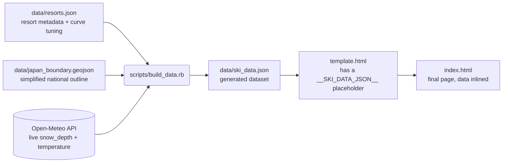

# Architecture

## Overview

Foray Ski Adventure is a static, backend-free web page. There is no server and
no runtime API calls from the browser — everything the page needs is computed
once at build time by a Ruby script and inlined into the HTML as JSON. The
browser only does rendering and interaction on data it already has.

This shape exists because the current deployment target (a Claude Artifact) is
sandboxed: it cannot make outbound network requests or load external map
tiles. See [PROPOSALS.md](./PROPOSALS.md) for how that changes once the site
moves to GitHub Pages, which has no such restriction.

## Build-time pipeline

`scripts/build_data.rb` does four things, in order, every time it runs:

1. **Fetch live conditions.** One batched HTTPS request to Open-Meteo for all
   resorts' current `snow_depth` and `temperature_2m`.
2. **Project the map.** Reads the simplified Japan boundary GeoJSON, computes
   an equirectangular projection with a cosine correction for longitude
   (so Hokkaido and Honshu keep the right relative shape), and produces one
   SVG path string for the coastline plus an `(x, y)` pair per resort.
3. **Generate the illustrative season curve.** For each resort, a bell curve
   (peaking at each resort's own `typical_peak_cm` on a shared mid-February
   date) and a parabolic temperature curve (mild at the season edges, coldest
   at that same date) are sampled every 3 days from Dec 1 to Apr 30. This is
   synthetic — clearly labeled as such in the UI — because no real historical
   time series exists yet.
4. **Write outputs.** `data/ski_data.json` (the raw generated dataset, useful
   on its own) and `index.html` (the template with that JSON spliced into the
   `<script type="application/json">` placeholder).

## Client-side render pipeline

Everything after that is a single inline `<script>` in `index.html`, an IIFE
with no external dependencies. There's one mutable `state` object
(`{ mode, dayIndex, selectedId }`) and a `refreshAll()` function that
re-derives all on-screen output from `state` + the embedded `DATA`:

| Function | Responsibility |
|---|---|
| `getDisplay(resort)` | Picks live vs. typical-season values for one resort based on `state.mode`/`state.dayIndex` |
| `tempToColor(temp)` | Diverging color scale, temperature → hex/rgb |
| `depthToRadius(depth)` | Area-proportional size scale, snow depth → marker radius |
| `renderMarkers()` | Updates every map `<circle>`'s radius/fill/stroke |
| `renderList()` | Rewrites each resort row's text in the sidebar list |
| `renderSizeLegend()` | Draws the size-legend circles using the same `depthToRadius` scale |
| `renderChart(resort)` / `renderFigures(resort)` | Draws the selected resort's season chart and monthly-figures table |
| `renderDetail(resort)` | Updates the stat row and calls the chart/figures renderers |
| `select(id)` / `setMode(mode)` / slider handler | Mutate `state`, then call `refreshAll()` (or `renderDetail` directly for `select`) |

There is no framework, no virtual DOM, and no build step on the client side —
`refreshAll()` just re-renders everything on every state change, which is fine
at this scale (20 resorts, a handful of DOM nodes each).

## Key design decisions

- **Area, not radius, for marker size.** Radius scaling linearly with depth
  makes a 6x difference in snow depth look like a ~33x difference in visual
  area (Stevens' power law). `depthToRadius` scales so *area* is proportional
  to depth (`radius ∝ √depth`), which is the standard, honest convention for
  proportional-symbol maps.
- **Diverging temperature color, centered on 0°C, with squared easing.** Blue
  below freezing, neutral gray at freezing, warm above — because freezing is
  the threshold that actually matters for snow. Linear interpolation between
  the cold and neutral colors looked muddy for realistic winter temperatures
  (mostly -6°C to -16°C), so the interpolation fraction is squared, which
  keeps hues saturated away from the pole and reserves gray for values
  genuinely close to 0°C.
- **0cm renders as a hollow ring at 60% of the floor size**, not a filled dot.
  A filled dot at the minimum radius is visually close to "a small amount of
  snow," which is ambiguous. A smaller, hollow ring is unambiguously "bare
  ground."
- **A static, pre-projected SVG map instead of tile imagery.** The Claude
  Artifact sandbox blocks loading map tiles from any external host, so the
  coastline is a single baked SVG `<path>` computed once at build time, and
  resort coordinates are pre-projected `(x, y)` pairs rather than raw lat/lon
  resolved in the browser. This has real costs — see PROPOSALS.md — but it's
  the only option that works inside the sandbox and needs zero client-side
  geo libraries.
- **Data is embedded inline, not fetched by the page.** Same constraint: the
  sandbox blocks `fetch`/XHR to external hosts, so there is no "loading"
  state — the page opens with the data it was built with.
- **The season curve is synthetic, not measured.** It exists to make the
  visualization meaningful during the off-season (when live depth is 0cm
  almost everywhere) and to preview what the size/color encoding looks like
  across a full range of values. It is explicitly labeled as illustrative
  everywhere it appears.

## Known constraints (as of this snapshot)

- No live network access from the deployed page — `index.html` is a snapshot
  as of whenever `scripts/build_data.rb` last ran.
- No real historical data — the "typical season" curve is a hand-tuned bell
  curve, not recorded observations.
- No automated tests (see PROPOSALS.md, section 3).
- All logic — CSS, HTML, and ~450 lines of JS — lives in one file
  (`template.html`), with no module boundaries.
